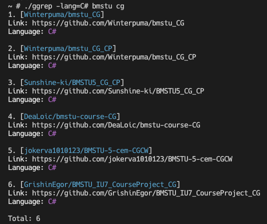

# ggrep
:mag: CLI utility to quickly browse GitHub repositories

## How to setup?
### A. Compile by yourself
1. Clone this repository to your local machine
2. `cd` to cloned repository
4. Run `chmod +x *.sh`
5. Launch (`Golang` compiler required)
    ```shell
    ./setup.sh <shell_config_file>
    ```
    `<shell_config_file>` can be `~/.zshrc`/`~/.bashrc`/etc
3. Now binary `ggrep` in `/home/bin` created

### B. Pull image and run via Docker
1. Run to pull container and run shell inside it
    ```shell
    docker run -it --rm humanbelnik/ggrep
    ```
## How to use?
### Launch
```shell
./ggrep [-lang=<programming_language>] <token1> ... <tokenX>
```
### Example

